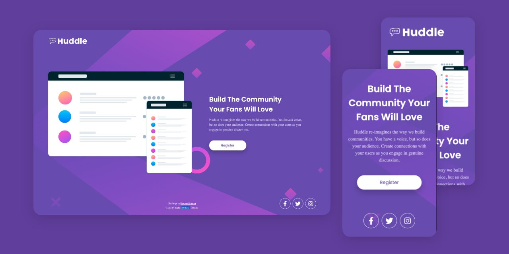

# Frontend Mentor - Huddle landing page with single introductory section

This is a solution to the [Huddle landing page with single introductory section challenge on Frontend Mentor](https://www.frontendmentor.io/challenges/huddle-landing-page-with-a-single-introductory-section-B_2Wvxgi0). Frontend Mentor challenges help you improve your coding skills by building realistic projects. 

## Table of contents

- [Overview](#overview)
  - [The challenge](#the-challenge)
  - [Screenshot](#screenshot)
  - [Links](#links)
- [My process](#my-process)
  - [Built with](#built-with)
  - [What I learned](#what-i-learned)
  - [Continued development](#continued-development)
  - [Useful resources](#useful-resources)
- [Author](#author)
<!-- - [Acknowledgments](#acknowledgments) -->

## Overview

### The challenge

Your users should be able to: 

- View the optimal layout for the page depending on their device's screen size
- See hover states for all interactive elements on the page

### Screenshot !



### Links !

- Solution URL: [Solution](https://www.frontendmentor.io/solutions/htmlandcss-bem-scss-profilecard-R_hU9jyi7)
- Live Site URL: [Live](https://grifano.github.io/FrontendMentor__Profile-Card/)

## My process

### Built with !

- Semantic HTML5 markup
- CSS custom properties
- SCSS
- Flexbox
- Responsive images
- Responsive Website

### What I learned !

I'w lear how to use a couple of images for background.
```css
.main-page {
	align-items: center;
	background-color: $brand-color;
	background-image: url("../images/bg-pattern-top.svg"), url("../images/bg-pattern-bottom.svg");
	background-size: contain, contain;
	background-position: -30% -300px, 130% 400px;
	background-attachment: fixed, fixed;
	background-repeat: no-repeat, no-repeat;
	flex-grow: 1;
	display: flex;
	justify-content: center;
	width: 100%;
}
```

SCSS is amazing 🤩! I was learned about variables and writing code inside the main class.
```scss
.profile-card {
	background-color: #fff;
	border-radius: 15px;
	box-shadow: 0px 8px 30px rgba(0, 0, 0, 0.1);
	overflow: hidden;
	margin: 20px;
	max-width: 280px;
	&__top {
		height: 120px;
		img {
			max-width: 100%;
			height: 100%;
			object-fit: cover;
		}
	}
}
```

### Continued development

I want to continue to learn a JavaScript. Currently, I'm working on Course from Udemy. App Brewery Web Developer Bootcamp. And to do practice, practice and practice one more 😉

### Useful resources !

["CSS Multiple Backgrounds"](https://www.w3schools.com/css/css3_backgrounds.asp)


## Author

- Website - [Serhii "{Grifano}" Orlenko"](https://grifano.webflow.io/)
- Frontend Mentor - [@Grifano](https://www.frontendmentor.io/profile/Grifano)
- Twitter - [@Grifano](https://twitter.com/OrlenkoSerhii)
- LinkedIn - [@Grifano](https://www.linkedin.com/in/serhii-orlenko-44aaa4a3/)

<!-- ## Acknowledgments ! -->